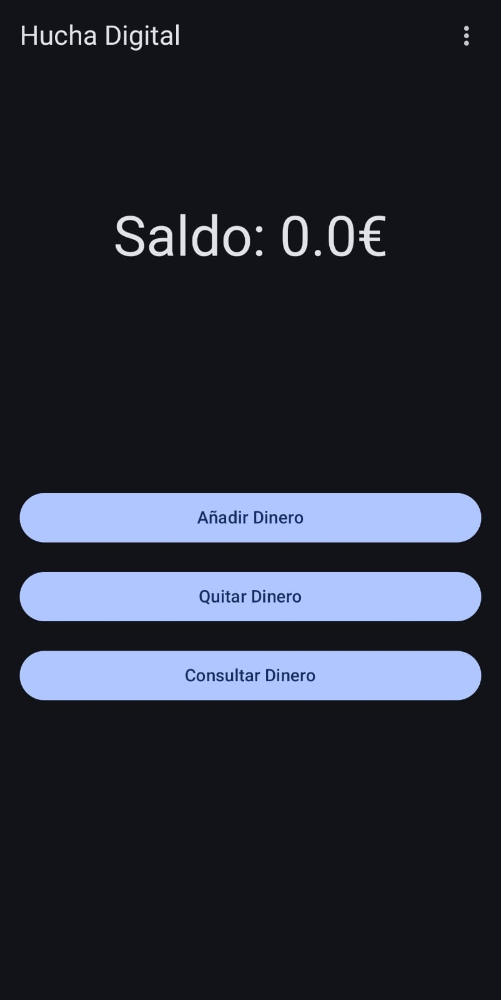
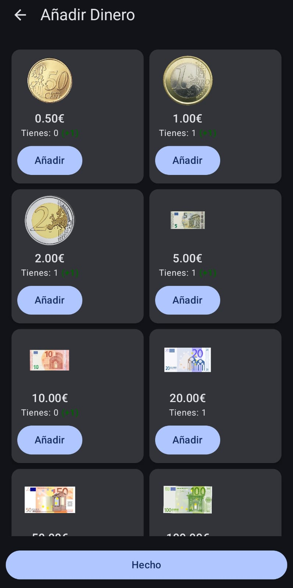
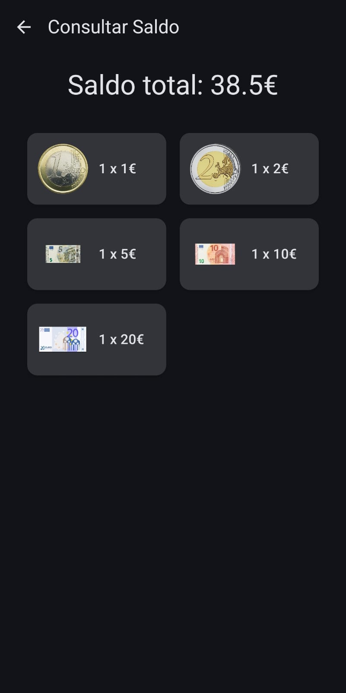
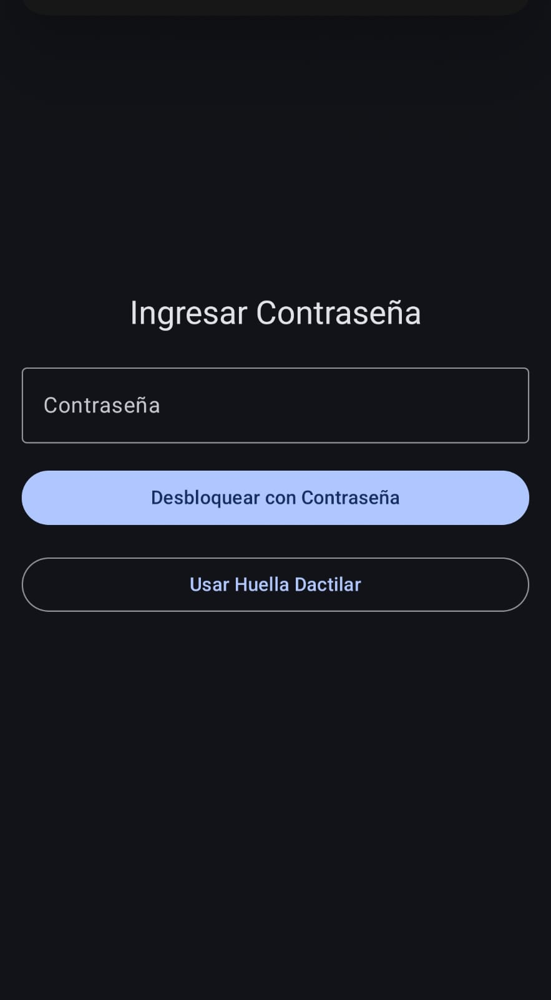
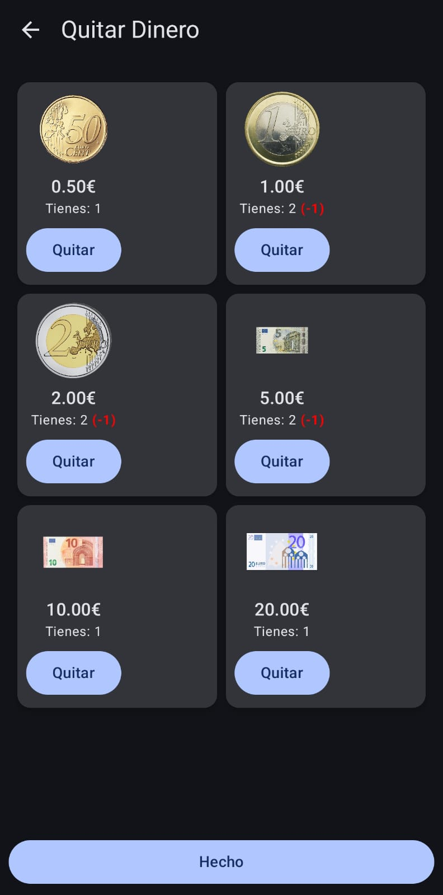

# Hucha Digital 🐷💰

Hucha Digital es una aplicación para Android que te ayuda a gestionar y realizar un seguimiento de tus ahorros de una manera sencilla y visual. ¡Alcanza tus metas financieras!

## ✨ Características

*   **Registro de Ahorros:** Añade y visualiza fácilmente tus depósitos.
*   **Privacidad:** Incluye la opción de iniciar sesión con contraseña y huella.
*   **(Próximamente):** Consulta todos tus movimientos de ahorro
*   **(Próximamente):** Gráficos o indicadores visuales de cuánto has ahorrado para tus metas.
*   **(Próximamente):** Múltiples huchas para diferentes objetivos.
*   **(Próximamente):** Recordatorios para ayudarte a mantener el hábito de ahorro.

## 📸 Capturas de Pantalla

| Menú Principal | Añadir Ahorro | Consultar Saldo |
| --- | --- | --- |
|  |  |  |

| Ingresar Contraseña | Eliminar Ahorro |
| --- | --- |
|  |  |

## 🚀 Instalación

1.  **Instalar APK:**

* Instale y abra el [APK](/app/release/HuchaDigital.apk) en su móvil android.

## 🛠️ Construido Con

*   [Android Studio](https://developer.android.com/studio) - El IDE oficial para el desarrollo de Android.
*   [Kotlin](https://kotlinlang.org/) - El lenguaje de programación principal.
*   [Jetpack Compose](https://developer.android.com/jetpack/compose) - Para la construcción de la interfaz de usuario moderna y declarativa.
*   Puede que se usen otras librerías de Jetpack como ViewModel, LiveData/Flow, Room (para persistencia de datos local), etc.

## 🤝 Contribuyendo

Las contribuciones son bienvenidas. Si deseas contribuir:

1.  Haz un Fork del Proyecto.
2.  Crea tu Rama de Característica (`git checkout -b feature/NuevaCaracteristica`).
3.  Confirma tus Cambios (`git commit -m 'Añade una NuevaCaracteristica Asombrosa'`).
4.  Empuja a la Rama (`git push origin feature/NuevaCaracteristica`).
5.  Abre una Pull Request.

## 📄 Licencia

Distribuido bajo la Licencia MIT. Mire `LICENSE.txt`
